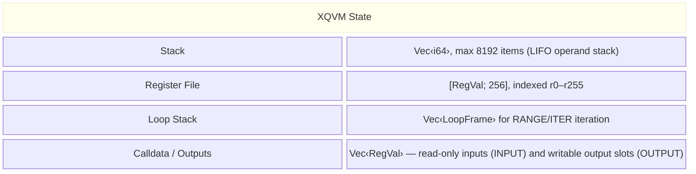

# VM Architecture

XQVM is a stack-based bytecode interpreter. A running VM holds four pieces of
mutable state:

## Design Principles

- **Stack-based computation** -- arithmetic and comparisons operate on an
  integer stack. This keeps the instruction set simple and compact.
- **Typed register file** -- registers hold polymorphic `RegVal` values (integers,
  vectors, models, samples). Type checking happens at runtime.
- **No heap / no pointers** -- there is no explicit memory allocation. Vectors
  and models grow dynamically within registers. Programs cannot address raw
  memory.
- **Deterministic execution** -- given the same program, calldata, and
  configuration, the VM always produces the same output. There are no
  random instructions or non-deterministic operations.
- **Embeddable** -- the VM crate supports `no_std + alloc`, enabling deployment
  in WASM runtimes and bare-metal environments.

## Chapters

- [Operand Stack](stack.md) -- the `i64` value stack
- [Register File](registers.md) -- the 256-slot typed register array
- [Loop Stack](loop-stack.md) -- range and iterator loop frames
- [Calldata and Outputs](calldata-outputs.md) -- external I/O slots
- [Execution Model](execution-model.md) -- the fetch-decode-execute cycle
