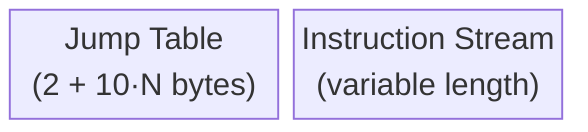

# Bytecode Format

This chapter describes the binary wire format of XQVM programs.

## Program Structure

A compiled program is a contiguous byte buffer with two sections:



There is no magic number, version field, or checksum. The jump table is always
present, even if empty (minimum 2 bytes for the entry count).

## Jump Table

The jump table maps label indices to byte offset ranges in the instruction
stream.

### Header

| Field | Type | Size | Description |
|-------|------|------|-------------|
| `entry_count` | `u16 BE` | 2 bytes | Number of jump table entries. |

### Per Entry (10 bytes each)

| Field | Type | Size | Description |
|-------|------|------|-------------|
| `label` | `u16 BE` | 2 bytes | Zero-based label index. |
| `start` | `u32 BE` | 4 bytes | Byte offset (inclusive) of the basic block start in the instruction stream. |
| `end` | `u32 BE` | 4 bytes | Byte offset (exclusive) of the basic block end. |

**Total jump table size:** `2 + 10 * entry_count` bytes.

A program with no labels has a 2-byte jump table (`entry_count = 0`).

### Byte Offset Reference

The `start` and `end` offsets are relative to the **instruction stream**, not
the entire program buffer. That is, offset `0` refers to the first byte after
the jump table.

## Instruction Encoding

Each instruction is encoded as:

```
[opcode: u8] [operand_0] [operand_1] ...
```

All multi-byte values are **big-endian**.

### Operand Types

| Type | Wire Size | Encoding |
|------|-----------|----------|
| Register | 1 byte | Raw `u8` slot index (0--255). |
| Label | 2 bytes | `u16 BE` jump table index. |
| `[u8; N]` (PUSH) | N bytes | Big-endian signed integer (1 ≤ N ≤ 8). Sign-extended to `i64` on decode. |

### Instruction Sizes

| Instruction | Total Bytes | Layout |
|-------------|-------------|--------|
| No-operand (NOP, HALT, ADD, POP, ...) | 1 | `[opcode]` |
| Single register (LOAD, STOW, BQMX, ...) | 2 | `[opcode, reg]` |
| Label, narrow (JUMP1, JUMPI1) | 2 | `[opcode, label]` |
| Label, wide   (JUMP2, JUMPI2) | 3 | `[opcode, label_hi, label_lo]` |
| PUSH1 | 2 | `[0x11, val]` |
| PUSH2 | 3 | `[0x12, val_hi, val_lo]` |
| PUSH3--PUSH7 | 4--8 | `[opcode, val_bytes...]` |
| PUSH8 | 9 | `[0x18, 8 bytes BE]` |
| ENERGY | 3 | `[0x7F, model_reg, sample_reg]` |

### PUSH Size Selection

The assembler and `InstructionBuilder::push()` automatically select the smallest
encoding that faithfully represents the value:

| Value Range | Instruction | Wire Bytes |
|-------------|-------------|------------|
| -128 to 127 | PUSH1 | 2 |
| -32,768 to 32,767 | PUSH2 | 3 |
| fits in 24-bit signed | PUSH3 | 4 |
| fits in 32-bit signed | PUSH4 | 5 |
| fits in 40-bit signed | PUSH5 | 6 |
| fits in 48-bit signed | PUSH6 | 7 |
| fits in 56-bit signed | PUSH7 | 8 |
| any `i64` | PUSH8 | 9 |

The constant is stored big-endian and sign-extended to `i64` on decode. For
example, `PUSH1 0xFF` decodes as `-1i64`.

## Example

Consider this program:

```asm
.0: TARGET
    PUSH 42
    JUMP .0
```

### Encoded Bytes

After QUI-405 the wire format is just the instruction stream -- no jump
table header. The runtime scans for `TARGET` opcodes when the program is
loaded and assigns each one a sequential id (0, 1, 2, ...) which `JUMP` /
`JUMPI` operands reference.

**Instruction stream** (5 bytes):
```
01              ; TARGET (0x01) -- becomes runtime target id 0
11 2A           ; PUSH1 42 (0x11, 0x2A)
02 00 00        ; JUMP2 .0 (0x02, 0x00, 0x00) -- wide form, references target id 0
```

**Total program:** 5 bytes (down from 16 -- the 11-byte header is gone).
