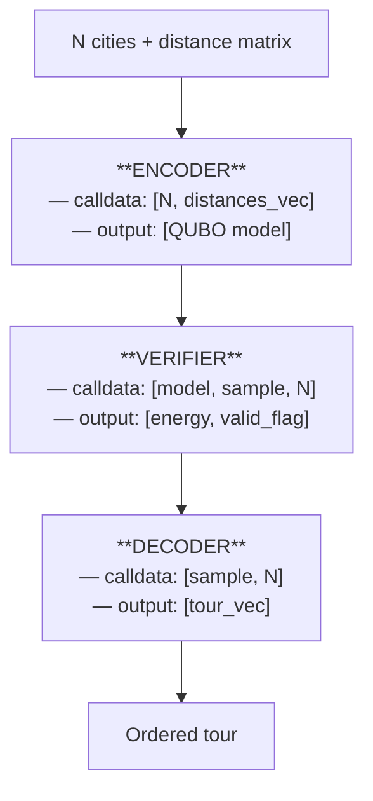
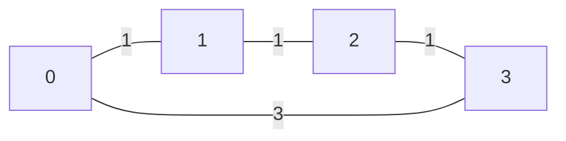

# Travelling Salesman Problem

This example demonstrates a three-program XQVM pipeline for formulating,
verifying, and decoding a Travelling Salesman Problem (TSP) as a QUBO
(Quadratic Unconstrained Binary Optimisation) problem.

Source: `crates/vm/examples/tsp/`

## Problem Encoding

For \\(N\\) cities, the QUBO uses \\(N \times N\\) binary variables \\(x_{c \cdot N + p}\\).
The Hamiltonian is:

$$H = H_{\text{dist}} + H_{\text{row}} + H_{\text{col}}$$

Where:

- \\(H_{\text{dist}}\\) -- distance cost: penalises longer tours by weighting adjacent
  city pairs.
- \\(H_{\text{row}}\\) -- one-hot per city: each city must visit exactly one position.
- \\(H_{\text{col}}\\) -- one-hot per position: each position must have exactly one city.

## Pipeline Overview



Each program runs in its own VM instance. The Rust harness marshals outputs
from one VM into calldata for the next.

## Test Case

4-city ring with symmetric distances:



Distance matrix (row-major):

```
[0, 1, 2, 3,
 1, 0, 1, 2,
 2, 1, 0, 1,
 3, 2, 1, 0]
```

## Encoder Program

The encoder receives `N` and the distance vector as calldata, builds the QUBO
model, and outputs it.

```asm
; Input slots:  [0] = N (Int), [1] = distances (VecInt, N*N row-major)
; Output slots: [0] = BQMX model

; Load inputs
PUSH 0
INPUT r0           ; r0 = N
PUSH 1
INPUT r1           ; r1 = distances vec

; Allocate N*N binary model with N×N grid
LOAD r0
COPY
MUL
STOW r2            ; r2 = N*N
LOAD r2
BQMX r4            ; r4 = binary QUBO model
LOAD r0
LOAD r0
RESIZE r4          ; grid: N rows × N cols

; Set penalty weight
PUSH 100
STOW r3            ; r3 = penalty

; H_dist: for each pair (ci, cj) with ci < cj, add distance terms
;   for each position p:
;     quad[ci*N+p, cj*N+(p+1)%N] += dist[ci][cj]
;     quad[cj*N+p, ci*N+(p+1)%N] += dist[ci][cj]
; ... (nested RANGE loops with ADDQUAD) ...

; H_row: one-hot constraint on each row
PUSH 0
LOAD r0
RANGE
  LVAL r5
  LOAD r5
  LOAD r3
  ONEHOTR r4       ; each city visits exactly one position
NEXT

; H_col: one-hot constraint on each column (manual expansion)
; ... (nested loops adding -penalty to linear, +2*penalty to quad pairs) ...

; Output the model
PUSH 0
OUTPUT r4
HALT
```

The full encoder source is in `crates/vm/examples/tsp/encoder.xqasm`.

## Verifier Program

The verifier receives the model, a sample, and N. It checks one-hot constraints
using `ROWSUM` and `COLFIND`, then evaluates the Hamiltonian energy.

Key instructions used:
- `ROWSUM` -- sum linear coefficients in each row to check assignment.
- `COLFIND` -- find which city occupies each position.
- `ENERGY` -- evaluate the full Hamiltonian.

## Decoder Program

The decoder receives the sample and N, then extracts the ordered tour using
`COLFIND` to find which city occupies each position:

```asm
; For each position p in 0..N:
;   tour[p] = COLFIND(sample, p, 1)  -- find row where column p has value 1
```

The result is a `VecInt` containing the ordered city indices.

## Rust Harness

The Rust harness (`main.rs`) orchestrates the pipeline:

```rust
// Step 1: Encode
let mut vm = Vm::new();
vm.set_calldata(vec![RegVal::Int(n as i64), RegVal::VecInt(distances)]);
vm.set_output_slots(1);
vm.run(&encoder_bc)?;
let qubo = vm.outputs()[0].clone();

// Step 2: Build identity sample (city i → position i)
let mut sample = XqmxModel::new(Domain::Binary, n * n);
sample.rows = n;
sample.cols = n;
for i in 0..n {
    sample.set_linear(i * n + i, 1);
}

// Step 3: Verify
let mut vm = Vm::new();
vm.set_calldata(vec![qubo, RegVal::Model(sample.clone()), RegVal::Int(n as i64)]);
vm.set_output_slots(2);
vm.run(&verifier_bc)?;
let energy = vm.outputs()[0];  // Int(-794)
let valid  = vm.outputs()[1];  // Int(1)

// Step 4: Decode
let mut vm = Vm::new();
vm.set_calldata(vec![RegVal::Model(sample), RegVal::Int(n as i64)]);
vm.set_output_slots(1);
vm.run(&decoder_bc)?;
let tour = vm.outputs()[0];    // VecInt([0, 1, 2, 3])
```

## Expected Results

For the identity tour (city i visits position i):

| Output | Value | Explanation |
|--------|-------|-------------|
| Energy | \\(-794\\) | \\(H_{\text{dist}}=6,\; H_{\text{one-hot}}(\text{linear})=-800,\; \text{net}=-794\\) |
| Valid | 1 | All one-hot constraints satisfied |
| Tour | [0, 1, 2, 3] | Identity mapping |
